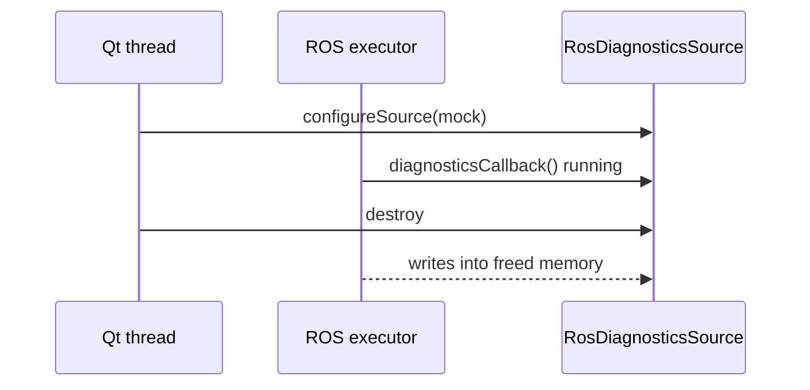

# Diagnostics Source Lifecycle

`DiagnosticsPanel` can swap its data source at runtime when the operator toggles
**Use Mock Diagnostics**, or when launch parameters are applied after RViz
restores a saved config. This note documents the ownership rules that make that
swap safe, because the source is read by the Qt thread and written by a ROS
executor thread at the same time.

## The problem

`RosDiagnosticsSource` owns a subscription to a `diagnostic_msgs/msg/DiagnosticArray`
topic. Two threads are involved:

| Thread | Work |
|--------|------|
| ROS executor | Runs the subscription callback and writes received diagnostics |
| Qt main thread | Runs the 1 Hz refresh timer, reads diagnostics, and swaps sources |

Switching from live back to mock destroys the live source from the Qt thread. If
the subscription callback holds a raw pointer to that object, the callback can be
executing on the executor thread at the moment the object is freed, which is a
use-after-free.



## Ownership rules

1. **Received state is owned separately from the source object.**
   `RosDiagnosticsSource` keeps its messages in a `SharedState` block held by
   `shared_ptr`. The subscription callback captures that `shared_ptr` by value
   instead of capturing `this`, so the callback never dereferences the source
   object and cannot outlive its own data.

2. **Retirement is explicit.** `DiagnosticsSource::stop()` is a virtual no-op that
   `RosDiagnosticsSource` overrides. It drops the subscription handle and then
   sets `active = false` under the state mutex. A callback already mid-write
   finishes first; any later dispatch of a queued message sees `active == false`
   and returns without touching the state.

3. **The panel retires before it replaces.** `DiagnosticsPanel::configureSource()`
   moves the outgoing source into a local variable, calls `stop()` on it, installs
   the replacement, and only then releases the retired source. This also
   guarantees a second subscription is never created while the first is still
   attached.

4. **The refresh timer pins its source.** `DiagnosticsPanel::refresh()` copies the
   `shared_ptr` for the duration of the tick, so a swap mid-tick cannot leave the
   widgets reading a half-replaced source.

5. **The panel destructor stops the timer first**, then stops the source, so no
   callback or timer fires against partly destroyed members.

The UI thread is never blocked for longer than one vector assignment, and no
source is leaked: `stop()` is idempotent and the destructor calls it.

## Repeatable stress check

`test/test_ros_diagnostics_source.cpp` is the automated equivalent of toggling
the checkbox repeatedly with the cycle publisher running. It spins a
`MultiThreadedExecutor` with four threads while a separate thread publishes on
the topic every 200 microseconds, then creates, reads, stops, and destroys live
sources in a loop.

| Test | What it proves |
|------|----------------|
| `ReportsWaitingBeforeAnyMessageArrives` | Live mode reports a waiting row before traffic |
| `NormalizesReceivedDiagnostics` | Received statuses map onto the internal contract |
| `StopFreezesStateAndIgnoresLaterMessages` | A retired source stops ingesting messages |
| `StopIsIdempotent` | Repeated `stop()` calls and later reads are safe |
| `RepeatedLiveMockChurnUnderTrafficIsSafe` | 300 create/stop/destroy cycles under load |
| `DestructionWithoutExplicitStopIsSafe` | The destructor alone retires the subscription |
| `ConcurrentReadsDuringTeardownAreSafe` | A reader thread racing `stop()` is safe |
| `ChurnLeavesNoLingeringSubscription` | No subscription leak after repeated churn |

Run it with:

```bash
source /opt/ros/jazzy/setup.bash
colcon build --packages-select waybionic_rviz_plugins --symlink-install
colcon test --packages-select waybionic_rviz_plugins
colcon test-result --all --verbose
```

### Confirming the stress check actually detects the race

A stress test that passes against both the broken and the fixed code proves
nothing, so the suite was validated by mutation under AddressSanitizer. The
stress test and `src/ros_diagnostics_source.cpp` were compiled standalone twice:
once against the current source, and once against a mutated copy whose
subscription callback captures `this` and whose `stop()` does not drop the
subscription, which is the ownership model that existed before this change.

| Build | Result |
|-------|--------|
| Current source | 4 stress tests pass |
| Mutated to capture `this` | `AddressSanitizer: heap-use-after-free` in `std::__shared_ptr<SharedState>::get()`, raised by `ConcurrentReadsDuringTeardownAreSafe` |

`new_delete_type_mismatch` has to be disabled for these runs because rclcpp's
internal C allocator shim trips it during plain node construction, unrelated to
this code:

```bash
ASAN_OPTIONS=detect_leaks=0:new_delete_type_mismatch=0 ./test_ros_diagnostics_source
```

### Manual GUI equivalent

```bash
# Terminal 1
ros2 launch waybionic_rviz_plugins temporary_diagnostics_publisher.launch.py mode:=cycle

# Terminal 2
ros2 launch waybionic_rviz_plugins engineer_view.launch.py use_mock_diagnostics:=false
```

Toggle **Use Mock Diagnostics** on and off repeatedly while messages arrive. Expected
behaviour: no crash or freeze, the source label alternates between `Mock` and
`ROS /diagnostics`, the mock buttons enable only in mock mode, and live rows resume
updating each time live mode is re-selected.
