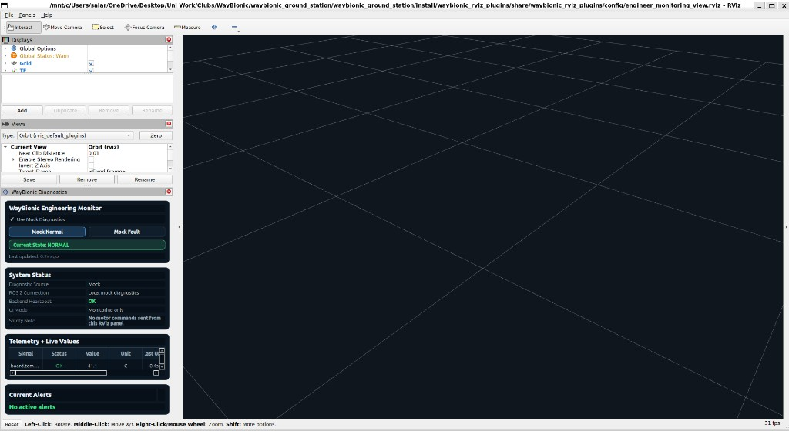
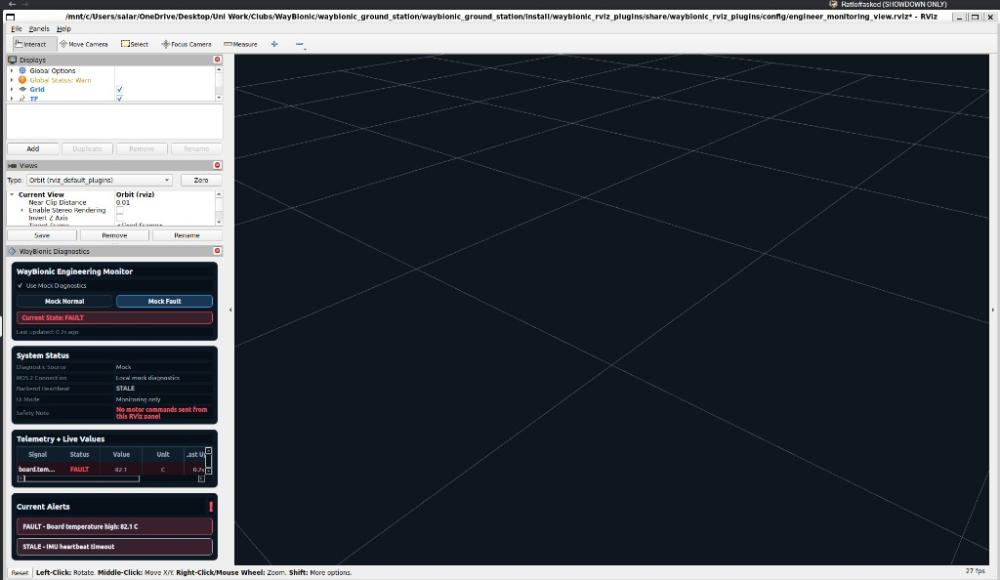

# PR Notes

## Review Screenshots

These images are included only to help reviewers see the UI quickly. They are not part of the runtime package behavior.

| Engineer view — mock normal | Engineer view — mock fault |
| --- | --- |
|  |  |

## Summary

This PR makes `waybionic_rviz_plugins` a focused WayBionic RViz2 diagnostics package. It keeps the engineer monitoring panel, mock/live diagnostics switching, and a temporary `/diagnostics` publisher for local validation.

Camera/doctor placeholder work was removed from this PR and will be handled separately later.

## Primary Launch Commands

```bash
colcon build --packages-select waybionic_rviz_plugins --symlink-install
source install/setup.bash
ros2 launch waybionic_rviz_plugins engineer_view.launch.py
```

Mock diagnostics (default):

```bash
ros2 launch waybionic_rviz_plugins engineer_view.launch.py use_mock_diagnostics:=true
```

Live diagnostics:

```bash
ros2 launch waybionic_rviz_plugins engineer_view.launch.py use_mock_diagnostics:=false diagnostics_topic:=/diagnostics
```

Temporary backend/demo publisher:

```bash
ros2 launch waybionic_rviz_plugins temporary_diagnostics_publisher.launch.py
ros2 launch waybionic_rviz_plugins temporary_diagnostics_publisher.launch.py mode:=cycle
```

## What Works

- Engineer RViz view with the `WayBionic Diagnostics` panel.
- Mock normal and fault validation states.
- Alert banner/table rendering from normalized `DiagnosticMessage` rows.
- Live diagnostics source path that subscribes to a `diagnostic_msgs/msg/DiagnosticArray` topic.
- Temporary `/diagnostics` publisher with `normal`, `fault`, `stale`, and `cycle` modes.
- Package metadata and lint/test wiring via `colcon test`.
- Only `DiagnosticsPanel` is registered in `plugin_description.xml`.

## Mock Diagnostics Mode

Mock mode is enabled by default through `use_mock_diagnostics:=true`. It uses synthetic values and keeps `Mock Normal` and `Mock Fault` controls enabled for UI validation while backend `/diagnostics` publishing is not ready.

## Live `/diagnostics` Path

`RosDiagnosticsSource` subscribes to `/diagnostics` by default, or another topic passed as `diagnostics_topic:=<topic>`, and converts each status into the internal `DiagnosticMessage` model before the panel renders it.

Expected mapping:

- `DiagnosticStatus.name` -> `signal_name`
- `OK` -> `OK`
- `WARN` -> `WARN`
- `ERROR` -> `FAULT`
- `STALE` -> `STALE`
- `DiagnosticStatus.message` -> `alert_message` for non-OK rows
- `DiagnosticStatus.values` -> `value` and `unit` when those keys are present
- `DiagnosticArray.header.stamp`, or receive time when unset, -> `timestamp`

## Temporary Diagnostics Publisher

`scripts/temporary_diagnostics_publisher.py` publishes sample `DiagnosticArray` messages for local testing while Korede/backend publishing is unavailable.

Modes:

- `normal` — OK telemetry
- `fault` — high board temperature + stale IMU heartbeat
- `stale` — all sample signals STALE
- `cycle` — rotate through normal/fault/stale every 5 seconds

## Lint / Test Wiring

```bash
colcon test --packages-select waybionic_rviz_plugins
colcon test-result --verbose
```

Tests verify:

- `DiagnosticsPanel` is registered in `plugin_description.xml`
- `SurgeonCameraPanel` is not registered
- `package.xml` has no Annin/AR4 dependency
- doctor/camera launch/config files are removed
- temporary diagnostics publisher files exist

## Optional AR4 Visualization Helper

Core package dependencies do not include Annin/AR4 packages. The generic launch is `engineer_view.launch.py`; it starts RViz only and does not require AR4 descriptions or passive joint publishers.

Optional AR4 coupling is isolated in:

- `launch/engineer_ar4_demo.launch.py`
- `config/engineer_ar4_demo.rviz`

## Testing Performed

```bash
source /opt/ros/jazzy/setup.bash
colcon build --packages-select waybionic_rviz_plugins --symlink-install
source install/setup.bash
colcon test --packages-select waybionic_rviz_plugins
colcon test-result --verbose
ros2 launch waybionic_rviz_plugins engineer_view.launch.py --show-args
ros2 launch waybionic_rviz_plugins temporary_diagnostics_publisher.launch.py --show-args
```

Optional AR4 helper, only in a workspace with AR4 dependencies:

```bash
ros2 launch waybionic_rviz_plugins engineer_ar4_demo.launch.py --show-args
```

## PR Status

Opened as https://github.com/Waybionic/waybionic_ground_station/pull/2 against `main`. Review screenshots at the top of this file are for reviewer context only.

## Known Limitations

- Meaningful live rows still depend on stable backend publishing once Korede is available.
- Stale handling is currently a simple five-second freshness check.
- The UI is monitoring-only and does not send motor commands.
- Camera/doctor workflow is out of scope for this PR.

## Next Steps

- Confirm final diagnostic signal names and value/unit conventions with backend.
- Merge diagnostics foundation, then handle camera/doctor low-latency workflow separately.
- Add focused runtime validation against Korede/backend once publishing is available.
